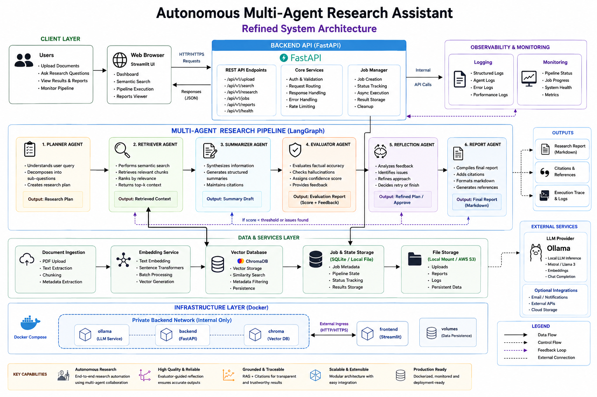

# Autonomous Multi-Agent Research Assistant

An end-to-end Agentic AI platform that automates the research workflow using specialized AI agents, Retrieval-Augmented Generation (RAG), semantic search, and evaluator-guided reflection loops. 

The system ingests documents, performs semantic retrieval, synthesizes research findings, evaluates response quality, and generates citation-backed reports through a multi-agent orchestration framework powered by **LangGraph**.

---
## 🔍 Overview

This project implements an autonomous research pipeline consisting of specialized AI agents that collaborate to produce high-quality, comprehensive research reports. By shifting from standard single-prompt RAG to a **graph-based multi-agent workflow**, the system breaks down complex queries, cross-references sources, self-evaluates for hallucinations, and refines its output autonomously before presenting it to the user.

## 📑 Table of Contents
- [Overview](#-overview)
- [🏗️ System Architecture](#️-system-architecture)
- [🤖 Agent Workflow & Core Pipeline](#-agent-workflow--core-pipeline)
- [✨ Key Features](#-key-features)
- [💻 Tech Stack](#-tech-stack)
- [📁 Project Structure](#-project-structure)
- [🛠️ Step-by-Step Implementation Guide](#️-step-by-step-implementation-guide)
- [🚀 Local Setup & Execution](#-local-setup--execution)
- [🐳 Docker Deployment](#-docker-deployment)
- [🎯 Example Use Cases](#-example-use-cases)
- [🔮 Future Enhancements](#-future-enhancements)
- [💼 Resume Highlights](#-resume-highlights)
- [📝 License](#-license)
- [👤 Author](#-author)

---
## 🏗️ System Architecture



---

## 🤖 Agent Workflow & Core Pipeline

The platform uses a stateful, cyclic graph managed by **LangGraph** to pass context seamlessly between specialized agents. Rather than running a single linear prompt, the system routes state transitions through a structured multi-agent loop:

```text
Planner ──> Retriever ──> Summarizer ──> Evaluator ──> Reflection ──> Report Generator
```
---

## 📋 Agent Responsibilities (The 6-Stage Deep Dive)

 **1. Planner Agent**
   * Decomposes user queries into structured research objectives.
   * Generates a research plan and retrieval strategy.

 **2. Retriever Agent**
   * Performs semantic search over ChromaDB.
   * Retrieves the most relevant context and source metadata.

 **3. Summarizer Agent**
   * Synthesizes retrieved information into a coherent draft.
   * Preserves source grounding and citations.

 **4. Evaluator Agent**
   * Assesses factual consistency and response quality.
   * Produces confidence scores and validation feedback.

 **5. Reflection Agent**
   * Uses evaluator feedback to identify missing context.
   * Triggers retrieval retries and plan refinement when needed.

 **6. Report Agent**
   * Generates the final citation-backed research report.
   * Formats outputs into publication-ready Markdown.

---

## ✨ Key Features

### 🤝 Multi-Agent Orchestration
* LangGraph-based stateful execution
* Conditional routing and reflection loops
* Structured agent-to-agent state transitions

### 📚 Retrieval-Augmented Generation (RAG)
* ChromaDB vector storage
* Semantic similarity search
* Citation-aware response generation

### 📄 Document Processing
* PDF ingestion with PyMuPDF
* Metadata-aware chunking and indexing
* Persistent vector storage

### 🛠️ Reliability & Monitoring
* Confidence-based evaluation
* Reflection-driven self-correction
* Structured logging and execution tracking

---

## 💻 Tech Stack

### Backend Architecture
* **Language:** Python
* **Framework:** FastAPI (Asynchronous API endpoints)
* **Orchestration:** LangGraph (Stateful multi-agent graphs)
* **Concurrency:** AsyncIO

### AI / ML Core
* **Local Inference:** Ollama (LLM orchestration)
* **Vector Store:** ChromaDB
* **Embeddings:** Sentence Transformers
* **Pattern Framework:** State-based RAG 

### User Interface & Ingestion
* **Frontend:** Streamlit
* **PDF Engine:** PyMuPDF

### DevOps & Infrastructure
* **Containerization:** Docker & Docker Compose
* **Cloud Infrastructure:** AWS EC2
* **Reverse Proxy / Server:** Nginx

---

## 📁 Project Structure

```text
research_agent/
│
├── backend/                  # FastAPI Application Core
│   ├── agents/               # Individual Agent LLM Prompts & Logic
│   ├── api/                  # REST Router Endpoints
│   ├── graph/                # LangGraph State Machine Definition
│   ├── jobs/                 # Background Job Workers & Queue Processors
│   ├── mcp/                  # Model Context Protocol Definitions
│   ├── pipelines/            # Ingestion Pipelines
│   └── services/             # Vectorstore, File-system & Business Logic
│
├── frontend/                 # Streamlit UI Layer
│   ├── components/           # Reusable UI Widgets
│   ├── pages/                # Streamlit Multi-page Routing
│   └── utils/                # API Handlers & Formatting Helpers
│
├── shared/                   # Shared Schemas & Common Type Interfaces
│
├── data/                     # Local Storage Data Mounts
│   ├── uploads/              # Raw File Ingestion Target
│   ├── reports/              # Final Compiled Markdown Outputs
│   └── vectorstore/          # Persistent ChromaDB Database Files
│
├── logs/                     # System & Execution Log Traces
│
├── docker-compose.yml        # Multi-Container Compose Manifest
├── requirements.txt          # Python Production Dependencies
└── README.md                 # Project Documentation
```
